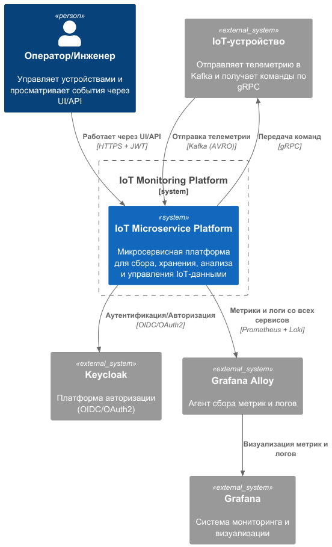
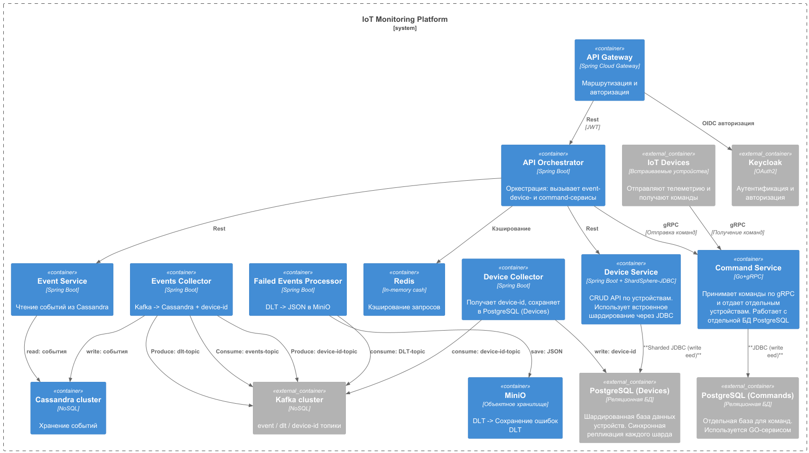
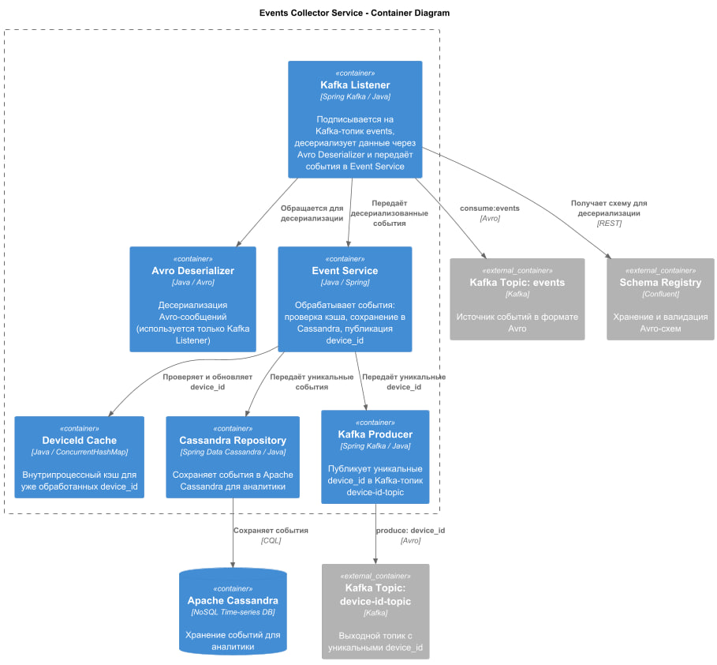

# IoT Microservice Platform
– учебный проект, демонстрирующий архитектуру микросервисов для IoT. Содержит инфраструктуру (Kafka, PostgreSQL, и др.) и пример реализации процессов IoT

## Быстрый старт через Makefile

```bash
  make up
```
```bash
  make down
```

## Архитектура: 

infrastructure/diagrams/context.puml



infrastructure/diagrams/containers.puml



infrastructure/diagrams/EventsCollectorComponent.puml



Запускаются:

* grafana ('localhost:3000')
* kafka ('localhost:9092')
* minio ('localhost:9000')
* postgres ('localhost:5432')
* prometheus ('localhost:9090')
* redis ('localhost:6379')
* schema-registry ('localhost:8081')
* zookeeper ('localhost:2181')


## Структура проекта
```
├───Makefile
├───README.md
├───.env.example
│
└───infrastructure
    ├───docker-compose.yaml
    └───config
        ├───prometheus
        │   └───prometheus.yml
        │
        └───diagrams
            ├───containers.puml
            ├───context.puml
            └───EventsCollectorComponent.puml

```

## Технологии
Языки и фреймворки

    Java 24, Spring Boot 3.5 (WebFlux и Web MVC)

    Go 1.20+ (Gin, Fiber или net/http) 

Базы данных и хранилища

    PostgreSQL (шардированная через Apache ShardingSphere)

    Apache Cassandra

    Redis (кэширование)

    MinIO (объектное хранилище, совместимое с S3) 

Системы обмена сообщениями

    Apache Kafka (Avro, Confluent Schema Registry) 

Оркестрация и управление процессами

    Camunda 

Безопасность и аутентификация

    Keycloak (OAuth2/OIDC, JWT) 

Мониторинг и наблюдаемость

    Spring Actuator, Micrometer, Prometheus, Grafana 

Докеризация и тестирование

    Docker, docker-compose

    Testcontainers

    JUnit, Mockito, ArchUnit 

## Ветки
    MODULE-1: init commit, описание и визуализация архитектуры, начальная конфигурация контейнеров